# Circuit Sokoban

A small, polished isometric **Sokoban-style circuit puzzle** built with libGDX,
targeting Linux desktop and Android from a single codebase. Push and rotate
connector pieces on a grid to route power from a source to a receiver and
complete the circuit.

> Personal hobby project — the emphasis is a clean, fun, replayable core loop
> over breadth of content. No audio.

## Gameplay

- **Isometric grid.** A walking avatar pushes pieces (classic Sokoban rules) and
  rotates them to align connectors.
- **Goal.** Energize a path of aligned connectors from the power **source** to
  the **receiver**.
- **Pieces & tiles.** Basic connectors plus one-way diodes, locked gates, one-use
  fuses, and ice — see the [reference table](#pieces--tiles) below for what each
  does, how it looks, and its states.
- **Scoring.** Pushes and rotations count toward your move total; walking is
  free. Solving under par earns **gold / silver / bronze**.
- **Undo / redo**, a **move counter**, and **par** derived from an optimal solver.
- **Endless, by tier.** Easy / Medium / Hard each stream generated levels; a
  level's *seed is its index*, so levels are reproducible and shareable.
- **Text-free tutorials.** The first time a new piece appears, the board dims and
  an animated gesture points you at the cell to act on — no words, no
  localization needed.
- **Juice.** Eased movement, a tile-by-tile "energize" sweep on solve, an idle
  pulse on the live-but-incomplete chain, particle bursts, and a camera punch.

## Pieces & tiles

Flat, abstract art, drawn procedurally (no sprite assets). Connectors are arms
radiating from a round joint: the **shape** tells you the type, the **colour**
tells you the power state — grey when idle, green when energized (pulsing while
the circuit is live but incomplete, steady once solved):

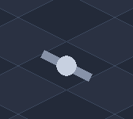 idle &nbsp;→&nbsp; 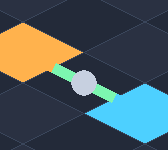 energized

| | Element | What it does |
|:-:|---|---|
|  | **Floor** | Ordinary tile you stand on and push pieces across. |
| 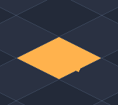 | **Power source** | Emits power; the start of the circuit. |
| 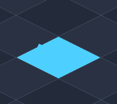 | **Receiver** | The goal — power must reach it. |
| 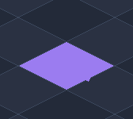 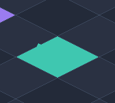 | **Secondary source / receiver** | Endpoints of the extra circuit that unlocks gates (violet source, teal receiver). |
| 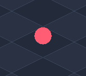 | **Player** | The token you move; walks freely and pushes pieces. |
|  | **Straight** | Conducts along one axis. |
|  | **Elbow** | Conducts around a corner. |
| 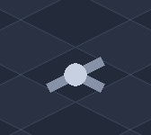 | **Tee** | A three-way junction. |
| 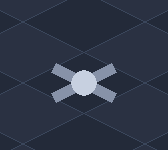 | **Cross** | Conducts all four ways (rotating it changes nothing). |
| 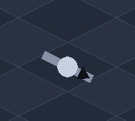 | **Diode** | Conducts **one way only** — current flows in the arrow's direction. Rotate to aim it. |
| 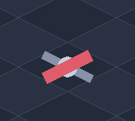 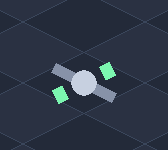 | **Gate** (locked → open) | Blocks the path until its secondary circuit completes, then **latches** open: the red barrier retracts and the wire runs through. |
| 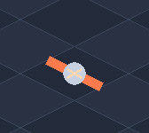 | **Fuse** | A **one-use** key on a secondary circuit: completing that circuit latches the gate, and the fuse burns out (gone, with a shatter burst) in the same instant. |
| 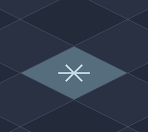 | **Ice tile** | A pushed piece that lands on it **slides** until it hits an obstacle; sliding pieces leave a faint trail. |

## Build & run

Requires **JDK 21**. Use the bundled Gradle wrapper (do **not** use a
system-wide Gradle — see [CLAUDE.md](CLAUDE.md)).

```bash
# Play (desktop, portrait window)
./gradlew :lwjgl3:run

# Pick a difficulty and/or a specific level seed
./gradlew :lwjgl3:run --args="--difficulty hard --seed 4"

# Run the tests (pure-logic, no rendering needed)
./gradlew :core:test
```

The app starts at the level-select menu; pick a tier and solve. Progress (best
moves, medals, current level per tier) persists between runs.

### Android

The same code runs on Android (portrait). You need the Android SDK; point the
build at it with a `local.properties` file containing `sdk.dir=/path/to/Android/Sdk`.

```bash
./gradlew :android:assembleDebug          # build a debug APK
# APK at android/build/outputs/apk/debug/android-debug.apk

# install + launch on a connected device/emulator
adb install -r android/build/outputs/apk/debug/android-debug.apk
adb shell am start -n com.circuitsokoban/com.circuitsokoban.android.AndroidLauncher
```

### Controls

| Action        | Desktop                          | Touch                       |
|---------------|----------------------------------|-----------------------------|
| Move / push   | Arrow keys or WASD               | Swipe                       |
| Rotate a piece| Click an adjacent piece (or `R`) | Tap a piece next to you     |
| Undo / redo   | `Z` / `Y`                        | —                           |
| Next level    | `Enter` (when solved)            | Tap (when solved)           |
| Back to menu  | `Esc`                            | Tap the **Menu** button     |

## Level generation

Levels are **solvable by construction**: generation starts from a fully solved
board and scrambles it with legal *reverse moves* (pulls + rotations). An
optimal breadth-first **solver** then validates each candidate and computes its
minimum move count, which becomes par and the difficulty rating. Diodes are
placed on the solution path, ice stays off it, and gates add a minimal secondary
circuit — all kept within a fast 5×5 / short-par envelope so generation is
instant.

## Project structure

Three Gradle modules. The `model`, `solver`, and most of `game` packages are
**pure Java (no libGDX)** and fully unit-tested; rendering/input sit on top, and
the two launchers are thin.

```
core/                         # shared game module
  com/circuitsokoban/
    model/     Direction, Pos, Piece, PieceType, Board, Circuit, MoveResult, Terminal
    solver/    Solver (BFS), StateKey, LevelGenerator (reverse-gen), GenParams, Level
    game/      PlaySession, PlayController, Progress, Tier, Navigator, Lesson, Tutorials, Store
    render/    IsoProjector, BoardRenderer, BoardView (juice), Palette, Particle, TutorialOverlay
    screen/    MenuScreen, GameScreen, LegendScreen
    input/     GameInput  (one InputProcessor for desktop + touch)
    CircuitSokobanGame.java  (Game entry / navigator)
lwjgl3/                       # desktop launcher (portrait 540×960)
android/                      # Android launcher (portrait, libGDX Android backend)
assets/                       # runtime working dir (procedural art — no texture assets)
```

## Tech

- **libGDX 1.14.2**, LWJGL3 desktop + Android backends
- **Java 21** (core compiled to Java 17 bytecode for Android's dexer),
  **Gradle 8.13** (via the wrapper), **AGP 8.11.1**
- Art is drawn procedurally with `ShapeRenderer` (flat geometric shapes) — no
  sprite assets to manage.

## Status

Playable end to end on **desktop and Android**: generation, solver, isometric
rendering, input, the juice layer, endless-by-tier level select with persistent
medals, all four advanced piece types (diode / gate / ice / one-use fuse), and
text-free tutorials.

Not yet built: a **hint** system. The HUD still uses a few English words (only
the tutorial is deliberately text-free), and the fixed 9:16 world letterboxes on
taller phones (fine, but a candidate for a follow-up layout tweak).
